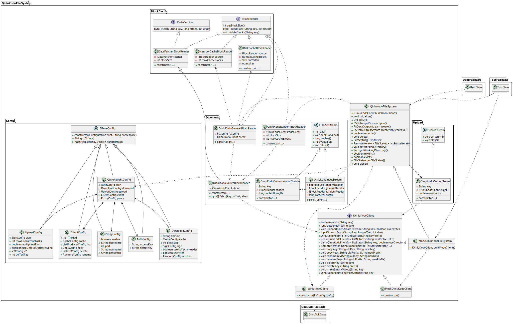
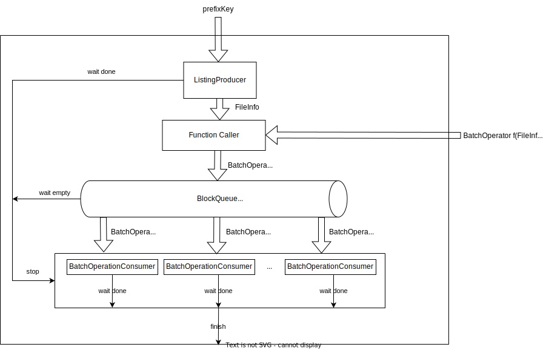

# 简介

七牛云海量存储系统（Kodo）是自主研发的非结构化数据存储管理平台，支持中心和边缘存储。
平台经过多年大规模用户验证已跻身先进技术行列，并广泛应用于海量数据管理的各类场景。它被广泛应用于中国的很多云服务用户，但是当前在
Apache Hadoop 项目中，缺少一种通过 Hadoop/Spark 原生支持操作 Kodo 的解决方案。

本项目旨在将 Kodo 原生集成到 Hadoop/Spark 项目中，使得用户可以通过 Hadoop/Spark 原生的 API 来操作 Kodo，而不需要额外的学习成本。

# 特性

+ 支持 Hadoop MapReduce 和 Spark 在 Kodo 上的读写操作
+ 实现了 Hadoop 文件系统的接口，通过模拟分级目录结构提供了和HDFS相同的使用体验
+ 支持大文件分片上传，最高支持 10TB 的单个文件
+ 使用了 Kodo 的 batch api，具有高性能的文件系统操作能力
+ 支持文件的内存块级缓存和磁盘块级缓存，提高了文件的读取性能

> 注意：
> 由于对象存储并不是文件系统，因此在使用上存在一些限制
> 1. 对象存储是基于 key-value 的存储，不支持分层目录结构，因此需要使用路径分隔符模拟分层目录结构
> 2. 不跟踪目录的修改和访问时间
> 3. Kodo 对象存储暂不支持文件的追加写入，因此不能在已有文件的末尾追加写入数据
> 4. 不跟踪文件的修改时间，因此在文件系统中，文件的修改时间为文件的创建时间
> 5. delete和rename的操作是非原子的，这意味着如果操作被意外中断，文件系统可能处于不一致的状态
> 6. 对象存储并不支持unix-like的权限管理，因此在文件系统中，因此需要提供以下规则：
>    + 目录权限为715
>    + 文件权限为666
>    + 文件所有者为本地当前用户
>    + 文件所有组为本地当前用户
> 7. 单次请求的最大文件数量为1000
> 8. 支持大文件分片上传，但分片数量限制为10000，由于单个分片的最大大小为1GB，因此最大支持10TB的单个文件
> 9. 
# 概念
+ **Bucket**: Kodo中存储数据的容器，其名称由用户自定义
+ **AccessKey**: Kodo中用于标识用户身份
+ **SecretKey**: Kodo中用于对用户身份进行验证的密钥
+ **kodo**: Hadoop-Qiniu中，使用`kodo`作为其URI scheme

# 项目结构设计

本项目的UML类图如下所示：

首先从宏观上来看，`QiniuKodoFileSystem` 类是整个系统与用户系统交互的唯一接口，假设 `UserClass` 代表了用户系统，`TestClass`
代表了测试模块。

本系统最终通过七牛的 Java SDK 来实现与七牛云对象存储后端的交互，假设 `QiniuSdkClass` 代表了七牛的Java SDK。

`QiniuKodoFileSystem` 类是 `Hadoop` 的 `FileSystem` 抽象类的实现类，它需要实现一些 `FileSystem` 抽象类中定义的一些抽象方法。

下面依次按照各个功能模块的核心入口类来分析系统的抽象结构：

## 配置信息

该模块主要是对七牛云对象存储的配置信息进行封装，包括七牛云对象存储的AK/SK、下载缓存的配置等。

该模块的入口类是 `QiniuKodoFsConfig`，其中组合了其他不同的配置类，如鉴权配置类`AuthConfig`、下载缓存配置类`DownloadConfig`
等。

它们通过`Hadoop`的`Configuration`类来读取XML中的配置信息，并将各个配置信息严格按照分级命名空间的方式反序列化到各个配置类的实例中。
通过各个配置类继承`ABaseConfig`抽象类，强制各个子类必须传递`Configuration`实例和`namespace`
字符串来构造实例，从而规范化了配置信息的分级管理，并可通过统一的`toString()`方法输出配置信息字符串，通过统一的`toHashMap()`方法
序列化配置对象。这实际是组合模式的一种应用。

最终，系统中其他各个模块都可以通过`QiniuKodoFsConfig`类来获取配置信息，而不需要再直接通过`Configuration`实例和`key`
字符串来访问配置信息。

## 文件写入

该模块主要是构造了一个 `QiniuKodoOutputStream` 类，它是 Hadoop 的 `FSDataOutputStream`
类的实现类，它基于了 `IQiniuKodoClient` 中的`upload()`方法，`PipedStream`管道流和`ExecutorService`线程池来实现。

最终 `QiniuKodoOutputStream` 类将在`QiniuKodoFileSystem`中的`create()`方法中被构造，从而实现了文件上传功能。

## 文件读取

文件下载是本系统中实现最复杂的一部分，其复杂之处在于需要实现文件的分块下载，内存块级缓存，磁盘块级缓存，文件随机读取等功能，并给予用户可通过配置项开启或关闭某些功能。

关于文件的块级缓存可单独抽取出一个相对独立的模块，在本系统的 UML 类图中，这些类在 `BlockCache` 包中。
首先定义了一个 `IBlockReader` 接口，其中包含了 `readBlock()` 接口方法，用于根据一个文件标识`key`
和块号来读取某个文件的块数据，返回为一个byte数组表示该块的内容。`IBlockReader` 中还定义了 `getBlockSize()`
接口方法，用于获取该`BlockReader`的块大小，`deleteBlocks()`方法主要用于删除某个文件的所有块缓存。在`BlockCache`
包中，`IBlockReader`的实现有三个，分别是 `MemoryCacheBlockReader`、`DiskCacheBlockReader`和`DataFetcherBlockReader`
。其中`MemoryCacheBlockReader`用于读取内存中存放的LRU块缓存，`DiskCacheBlockReader`
用于读取磁盘中存放的LRU块缓存，这两个缓存实现类实际是是装饰器模式的一种应用。`DataFetcherBlockReader`
是一个接口适配器，用于将`IDataFetcher`接口适配到`IBlockReader`接口实现，这是适配器模式的一种应用。

接着在`Download`包中定义了一些关于文件下载的实现类，其中`QiniuKodoSourceBlockReader`类继承了`DataFetcherBlockReader`
类并重写了其中的fetch()方法，该方法的实现实际上调用了`IQiniuKodoClient`类的实例中的`fetch()`
方法。实际上这相当于是一个适配器，将`IQiniuKodoClient`接口适配到`IBlockReader`接口，这将用于以块的形式访问对象存储中的文件。

定义了一个`QiniuKodoGeneralBlockReader`类，这个类实现了`IBlockReader`
接口，在其中综合了元数据读取层`QiniuKodoSourceBlockReader`，内存缓存读取层`MemoryCacheBlockReader`
，磁盘缓存读取层`DiskCacheBlockReader`，实现了最终的块读取接口。

定义了一个`QiniuKodoRandomBlockReader`类，该类主要针对随机读取的场景做了一些优化，该类不使用磁盘缓存，仅使用内存缓存。

定义了一个`QiniuKodoCommonInputStream`，该类是Hadoop的`FSDataInputStream`类的实现类，它实际上是一个将实现了`IBlockReader`
接口的实例对象包装成为一个实现了`Hadoop`的`FSDataInputStream`的实现类的一个适配器。

定义了一个`QiniuKodoInputStream`类，它实现了通用`IBlockReader`与随机`IBlockReader`
的动态切换，实现了最终的文件下载类`QiniuKodoInputStream`，这是策略模式的一种体现。

于是我们便在`QiniuKodoFileSystem`中的`open()`方法中根据两种不同的`IBlockReader`构造了`QiniuKodoInputStream`，从而实现了文件下载功能。

## 文件系统操作

文件系统操作主要需要完成 `QiniuKodoFileSystem`
中 `rename(), delete(), listStatus(), mkdirs(), exists(), getFileStatus()`
等方法的实现。这些操作完全基于了 `IQiniuKodoClient` 中的方法，针对 `rename(), delete()`
这两个方法的实现，实际上是基于了 `IQiniuKodoClient`
中的 `copyKey(), copyKeys(), renameKey(), renameKeys(), deleteKey(), deleteKeys()` 等方法而实现。

## 集成测试

假设集成测试中的测试类为 `TestClass`，它可通过配置项选择是否使用基于mock的集成测试。

如果选择使用基于mock的集成测试，则会构造 `MockQiniuKodoFileSystem` 类，它是 `QiniuKodoFileSystem`
类的子类，通过重写其中的 `buildKodoClient()` 方法，它将会构造 `MockQiniuKodoClient` 类的实例，作为 `QiniuKodoFileSystem`
类中的 `IQiniuKodoClient` 类的实现类。这样我们可以在不需要连接真实的七牛云对象存储后端的情况下，对整个系统进行集成测试。

如果选择不使用基于mock的集成测试，则会构造真实的 `QiniuKodoFileSystem` 类，它自身的 `buildKodoClient()`
方法将会直接构造 `QiniuKodoClient` 类的实例，作为 `QiniuKodoFileSystem` 类中的 `IQiniuKodoClient`
类的实现类。注意，这种情况下，系统将会连接真实的七牛云对象存储 Kodo 服务器后端，因此需要配置好七牛云对象存储的AK/SK等信息。

# 文件系统模拟操作的设计

文件系统中的主要操作包括：`rename(), delete(), listStatus(), mkdirs(), getFileStatus()` 等方法的实现。

## getFileStatus(Path p)

`getFileStatus(Path p)` 方法的实现较为简单，它直接调用了 `IQiniuKodoClient`
中的 `QiniuKodoFileInfo getFileInfo(String key)` 方法，将其返回值转换为 `FileStatus` 类型后返回即可。其字段转换过程如下：

| FileStatus中的字段    | 转换过程                          |
|:------------------|:------------------------------|
| length            | 直接映射到对象的大小                    |
| isdir             | 查找bucket中是否存在该路径对应的表示文件夹的空对象  |
| blockSize         | 使用配置文件中的分块下载的块大小              |
| modification_time | 直接映射到对象的上传时间                  |
| access_time       | 直接映射到对象的上传时间                  |
| permission        | 文件权限，文件夹使用权限 0715，文件使用权限 0666 |
| owner             | 当前hadoop运行所在的系统用户             |
| group             | 当前hadoop运行所在的系统用户             |
| path              | 按照指定的路径映射规则对对象的key映射到文件系统的路径  |

## mkdirs(Path path)

创建文件夹的操作，实际上是在七牛云对象存储中创建一个空对象，该对象的key为指定路径的前缀，且以`/`
结尾，例如，如果指定路径为`/test/`，则在七牛云对象存储中创建一个空对象，其key为`test/`
。若要创建多级文件夹，则需要依次创建每一级文件夹。例如，如果指定路径为`/test/test1/test2/`
，则需要在指定的bucket中依次创建出`test/`、`test/test1/`、`test/test1/test2/`三个空对象。

## listStatus(Path path)

实际上Hadoop中提供了两种不同的`listStatus()`方法，分别是`FileStatus[] listStatus(Path f)`
和`RemoteIterator<FileStatus> listStatusIterator(Path f)`。其中，`FileStatus[] listStatus(Path f)`
方法的实现是将`RemoteIterator<FileStatus> listStatusIterator(Path f)`方法返回的`RemoteIterator<FileStatus>`
对象转换为`FileStatus[]`数组后返回的。因此，我们只需要实现`RemoteIterator<FileStatus> listStatusIterator(Path f)`方法即可。

## RemoteIterator<FileStatus> listStatusIterator(Path f)

该方法的实现是基于对象存储中常见的`listStatus`
操作实现的，原始SDK中的列举方法为`listStatus(String prefix, String delimiter, String marker, int limit)`，其中：

1. `String prefix`表示了本次列举所有前缀为`prefix`的对象
2. `String delimiter`表示了路径分隔符，若指明该参数，返回结果中将包含`commonPrefixes`字段
3. `String marker`表示了列举的起始位置，若指明该参数，返回结果中将包含`nextMarker`字段
4. `int limit`表示了本次列举的最大数量

该方法的返回值包含了如下：

1. `FileInfo[] files`表示本次列举的所有对象的元数据
2. `String[] commonPrefixes`表示了指定前缀所有对象的，以`delimiter`
   参数为分隔符的最短的所有公共前缀，实际上该参数就可以用来使平铺的`Key/Value`
   模型的对象存储来模拟文件系统的树形结构的关键，它可以直接映射为文件系统中指定路径下的子文件夹的概念，正因如此所以文件夹不包含任何元数据，故针对文件夹的`getFileStatus()`
   中的`modification_time`、`access_time`等字段实现均为0。
3. `String nextMarker`表示了下一次列举的起始位置

于是不断地反复调用`listStatus(String prefix, String delimiter, String marker, int limit)`方法，直到`nextMarker`
字段为空，即可完成整个文件夹的列举操作。可以使用迭代器模式来简化这一过程的用法。

## delete(Path path, boolean recursive)

删除给定的文件或文件夹，删除文件可直接映射为SDK中的delete api调用。

删除文件夹实际上是通过调用`QiniuKodoClient`中的`deleteKeys(String prefix)`方法实现的。

## rename(Path src, Path dst)

重命名文件夹实际上是通过先调用`copyKeys(String oldPrefix, String newPrefix)`
复制指定前缀的所有对象，再调用`deleteKeys(String prefix)`删除指定前缀的所有对象来实现的。

## Batch 操作

上述实现中用到的copyKeys()、deleteKeys()、listStatus()等方法都是基于七牛云存储提供的高效batch
api实现的，单次请求最多可操作处理1000个对象，因此，我们可以将这些对象分批次地处理，直到所有对象都处理结束为止。

为了进一步优化这些batch操作的性能，我们可以使用多线程来并发地操作对象，以提高文件夹级别的批处理性能。这实际上是一个单生产者-多消费者的模型，我们可以使用`BlockingQueue`
来实现生产者和消费者之间的通信。其示意图如下：

用户输入一个 `prefixKey`和一个`FileInfo --> BatchOperator`的映射函数`f`，后续将通过 `ListingProducer`不断列举出`FileInfo`
对象，经由函数`f`处理后得到待操作的`BatchOperator`对象，后续`BatchOperator`对象将被放入`BlockingQueue`中，`BatchOperator`
对象将被`BatchConsumer`不断地从`BlockingQueue`
中取出，根据配置文件积攒够给定的量后批量向服务器提交任务请求。当生产者生产完毕，并且`BlockingQueue`
中没有待处理的`BatchOperator`对象时，向所有的`BatchConsumer`发送停止请求，此时所有的`BatchConsumer`
将会将自身剩余的任务提交给服务器，然后退出。当所有的`BatchConsumer`都完成了自身剩余的任务后，整个批处理过程结束。

# 配置项

| 配置项                                                          | 说明                                                                                                                     |    默认值    | 是否必填 |
|:-------------------------------------------------------------|:-----------------------------------------------------------------------------------------------------------------------|:---------:|:----:|
| fs.qiniu.auth.accessKey                                      | 七牛云对象存储的 access key                                                                                                    |   None    | YES  |
| fs.qiniu.auth.secretKey                                      | 七牛云对象存储的 secret key                                                                                                    |   None    | YES  |
| fs.kodo.impl                                                 | 配置Hadoop的文件系统实现类                                                                                                       |   None    | YES  |
| fs.AbstractFileSystem.kodo.impl                              | 配置Hadoop的抽象文件系统实现类                                                                                                     |   None    | YES  |
| fs.defaultFS                                                 | 配置Hadoop的默认文件系统                                                                                                        |   None    |  NO  |
| fs.qiniu.proxy.enable                                        | 是否启用代理配置                                                                                                               |   false   |  NO  |
| fs.qiniu.proxy.host                                          | 代理服务器地址                                                                                                                | 127.0.0.1 |  NO  |
| fs.qiniu.proxy.port                                          | 代理服务器端口                                                                                                                |   8080    |  NO  |
| fs.qiniu.proxy.user                                          | 代理服务器用户名                                                                                                               |   None    |  NO  |
| fs.qiniu.proxy.pass                                          | 代理服务器密码                                                                                                                |   None    |  NO  |
| fs.qiniu.proxy.type                                          | 代理服务器类型                                                                                                                |   HTTP    |  NO  |
| fs.qiniu.download.useHttps                                   | 下载文件时是否使用HTTPS                                                                                                         |   true    |  NO  |
| fs.qiniu.download.blockSize                                  | 分块下载文件时每个块的大小。单位为字节                                                                                                    |  4194304  |  NO  |
| fs.qiniu.download.domain                                     | 下载文件时使用的域名，默认自动使用源站域名，用户可配置该项使用CDN加速域名                                                                                 |   None    |  NO  |
| fs.qiniu.download.sign.enable                                | 是否启用下载签名                                                                                                               |   true    |  NO  |
| fs.qiniu.download.sign.expires                               | 下载签名有效期，单位为秒                                                                                                           |    180    |  NO  |
| fs.qiniu.download.cache.disk.enable                          | 是否启用磁盘缓存                                                                                                               |   false   |  NO  |
| fs.qiniu.download.cache.disk.expires                         | 磁盘缓存过期时间，单位为秒。默认值为一天                                                                                                   |   86400   |  NO  |
| fs.qiniu.download.cache.disk.blocks                          | 磁盘缓存的最大块数                                                                                                              |    120    |  NO  |
| fs.qiniu.download.cache.disk.dir                             | 磁盘缓存路径                                                                                                                 |   None    |  NO  |
| fs.qiniu.download.cache.memory.enable                        | 是否启用内存缓存                                                                                                               |   true    |  NO  |
| fs.qiniu.download.cache.memory.blocks                        | 内存缓存的最大块数                                                                                                              |    25     |  NO  |
| fs.qiniu.download.random.enable                              | 是否启用随机读取优化                                                                                                             |   false   |  NO  |
| fs.qiniu.download.random.blockSize                           | 随机读取优化时每个块的大小。单位为字节                                                                                                    |   65536   |  NO  |
| fs.qiniu.download.random.maxBlocks                           | 随机读取优化时最大的块数                                                                                                           |    100    |  NO  |
| fs.qiniu.useHttps                                            | 是否使用HTTPS协议进行文件上传，文件管理                                                                                                 |   true    |  NO  |
| fs.qiniu.upload.useDefaultUpHostIfNone                       | 如果从uc服务器获取的域名上传失败，则使用默认上传域名                                                                                            |   true    |  NO  |
| fs.qiniu.upload.sign.expires                                 | 上传签名有效期，单位为秒                                                                                                           |  604800   |  NO  |
| fs.qiniu.upload.accUpHostFirst                               | 是否优先使用加速域名                                                                                                             |   false   |  NO  |
| fs.qiniu.upload.maxConcurrentTasks                           | 最大并发上传任务数                                                                                                              |    10     |  NO  |
| fs.qiniu.upload.v2.enable                                    | 是否启用七牛云V2分片上传                                                                                                          |   true    |  NO  |
| fs.qiniu.upload.v2.blockSize                                 | 七牛云V2分片上传时每个分片的大小。单位为字节                                                                                                | 33554432  |  NO  |
| fs.qiniu.upload.bufferSize                                   | hadoop 与 qiniu-java-sdk 之间的上传管道缓冲区大小。单位为字节                                                                             | 16777216  |  NO  |
| fs.qiniu.client.cache.enable                                 | 是否启用七牛云客户端缓存，将针对文件系统操作做部分优化                                                                                            |   true    |  NO  |
| fs.qiniu.client.cache.maxCapacity                            | 七牛云客户端最大缓存数                                                                                                            |    100    |  NO  |
| fs.qiniu.client.list.useListV2                               | 是否使用 list v2 api 进行文件列举                                                                                                |   false   |  NO  |
| fs.qiniu.client.list.singleRequestLimit                      | 单次列举文件时最大的文件数                                                                                                          |   1000    |  NO  |
| fs.qiniu.client.list.bufferSize                              | 文件列举生产者的生产缓冲区大小                                                                                                        |    100    |  NO  |
| fs.qiniu.client.list.offerTimeout                            | 文件列举生产者的生产缓冲区满时的轮询等待时间。单位为毫秒                                                                                           |    10     |  NO  |
| fs.qiniu.client.copy.listProducer.useListV2                  | 文件拷贝时的文件列举生产者是否使用 list v2 api 进行文件列举                                                                                   |   false   |  NO  |
| fs.qiniu.client.copy.listProducer.singleRequestLimit         | 文件拷贝时的文件列举生产者单次列举文件时最大的文件数                                                                                             |   1000    |  NO  |
| fs.qiniu.client.copy.listProducer.bufferSize                 | 文件拷贝时的文件列举生产者文件列举生产者的生产缓冲区大小                                                                                           |    100    |  NO  |
| fs.qiniu.client.copy.listProducer.offerTimeout               | 文件拷贝时的文件列举生产者的生产缓冲区满时的轮询等待时间。单位为毫秒                                                                                     |    10     |  NO  |
| fs.qiniu.client.copy.batchConsumer.bufferSize                | 文件拷贝时的消费者的消费缓冲区大小                                                                                                      |   1000    |  NO  |
| fs.qiniu.client.copy.batchConsumer.count                     | 文件拷贝时的消费者的数量                                                                                                           |     4     |  NO  |
| fs.qiniu.client.copy.batchConsumer.singleBatchRequestLimit   | 文件拷贝时的消费者单次消费请求的最大文件数                                                                                                  |    200    |  NO  |
| fs.qiniu.client.copy.batchConsumer.pollTimeout               | 文件拷贝时的消费缓冲区空时的轮询等待时间。单位为毫秒                                                                                             |    10     |  NO  |
| fs.qiniu.client.delete.listProducer.useListV2                | 文件删除时的文件列举生产者是否使用 list v2 api 进行文件列举                                                                                   |   false   |  NO  |
| fs.qiniu.client.delete.listProducer.singleRequestLimit       | 文件删除时的文件列举生产者单次列举文件时最大的文件数                                                                                             |   1000    |  NO  |
| fs.qiniu.client.delete.listProducer.bufferSize               | 文件删除时的文件列举生产者文件列举生产者的生产缓冲区大小                                                                                           |    100    |  NO  |
| fs.qiniu.client.delete.listProducer.offerTimeout             | 文件删除时的文件列举生产者的生产缓冲区满时的轮询等待时间。单位为毫秒                                                                                     |    10     |  NO  |
| fs.qiniu.client.delete.batchConsumer.bufferSize              | 文件删除时的消费者的消费缓冲区大小                                                                                                      |   1000    |  NO  |
| fs.qiniu.client.delete.batchConsumer.count                   | 文件删除时的消费者的数量                                                                                                           |     4     |  NO  |
| fs.qiniu.client.delete.batchConsumer.singleBatchRequestLimit | 文件删除时的消费者单次消费请求的最大文件数                                                                                                  |    200    |  NO  |
| fs.qiniu.client.delete.batchConsumer.pollTimeout             | 文件删除时的消费缓冲区空时的轮询等待时间。单位为毫秒                                                                                             |    10     |  NO  |
| fs.qiniu.logger.level                                        | 日志级别                                                                                                                   |   INFO    |  NO  |
| fs.qiniu.test.useMock                                        | 测试环境是否使用mock进行集成测试                                                                                                     |   false   |  NO  |
| fs.qiniu.customRegion.id                                     | 自定义区域id                                                                                                                |   None    |  NO  |
| fs.qiniu.customRegion.custom.{id}.ucServer                   | 注意{id}为`fs.qiniu.customRegion.id`中自定义的id。该配置项用于自定义区域ucServer地址，如果该字段被配置了，则后续字段将自动配置，无需手工配置。例如`https://uc.qiniuapi.com` |   None    |  NO  |
| fs.qiniu.customRegion.custom.{id}.rsHost                     | kodo 服务的 rs 域名，例如`rs-z0.qiniuapi.com`                                                                                  |   None    |  NO  |
| fs.qiniu.customRegion.custom.{id}.rsfHost                    | kodo 服务的 rsf 域名，例如`rsf-z0.qiniuapi.com`                                                                                |   None    |  NO  |
| fs.qiniu.customRegion.custom.{id}.apiHost                    | kodo 服务的 api 域名，例如`api.qiniuapi.com`                                                                                   |   None    |  NO  |
| fs.qiniu.customRegion.custom.{id}.iovipHost                  | kodo 服务的 iovip 域名，例如`iovip.qiniuio.com`                                                                                |   None    |  NO  |
| fs.qiniu.customRegion.custom.{id}.accUpHosts                 | kodo 服务的加速上传域名，例如`upload.qiniup.com`，如果有多个，请使用逗号分割                                                                     |   None    |  NO  |
| fs.qiniu.customRegion.custom.{id}.srcUpHosts                 | kodo 服务的源站上传域名，例如`up.qiniup.com`，如果有多个，请使用逗号分割                                                                         |   None    |  NO  |
| fs.qiniu.customRegion.custom.{id}.ioSrcHost                  | kodo 服务的源站下载域名，例如 `kodo-cn-east-1.qiniucs.com                                                                          |   None    |  NO  |

# 限制

默认使用七牛云 Kodo 上传接口的v2版本，该版本支持分片上传，最大分片数量为10000，每个分片的最大大小为1GB。因此，支持的单个最大文件大小为10000GB，即10TB。