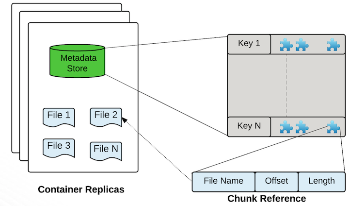
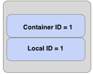

<!---
  Licensed to the Apache Software Foundation (ASF) under one or more
  contributor license agreements.  See the NOTICE file distributed with
  this work for additional information regarding copyright ownership.
  The ASF licenses this file to You under the Apache License, Version 2.0
  (the "License"); you may not use this file except in compliance with
  the License.  You may obtain a copy of the License at

      http://www.apache.org/licenses/LICENSE-2.0

  Unless required by applicable law or agreed to in writing, software
  distributed under the License is distributed on an "AS IS" BASIS,
  WITHOUT WARRANTIES OR CONDITIONS OF ANY KIND, either express or implied.
  See the License for the specific language governing permissions and
  limitations under the License.
-->

Datanodes are the worker bees of Ozone. All data is stored on data nodes.
Clients write data in terms of blocks. Datanode aggregates these blocks into
a storage container. A storage container is the data streams and metadata
about the blocks written by the clients.

## Storage Containers

A storage container is a self-contained super block. It has a list of Ozone
blocks that reside inside it, as well as on-disk files which contain the
actual data streams. This is the default Storage container format. From
Ozone's perspective, container is a protocol spec, actual storage layouts
does not matter. In other words, it is trivial to extend or bring new
container layouts. Hence this should be treated as a reference implementation
 of containers under Ozone.

## Understanding Ozone Blocks and Containers

When a client wants to read a key from Ozone, the client sends the name of
the key to the Ozone Manager. Ozone manager returns the list of Ozone blocks
that make up that key.

An Ozone block contains the container ID and a local ID. The figure below
shows the logical layout out of Ozone block.

The container ID lets the clients discover the location of the container. The
authoritative information about where a container is located is with the
Storage Container Manager or SCM. In most cases, the container location will
cached by Ozone Manager and will be returned along with the Ozone blocks.

Once the client is able to locate the contianer, that is, understand which
data nodes contain this container, the client will connect to the datanode
read the data the data stream specified by container ID:Local ID. In other
words, the local ID serves as index into the container which describes what
data stream we want to read from.

### Discovering the Container Locations

How does SCM know where the containers are located ? This is very similar to
what HDFS does; the data nodes regularly send container reports like block
reports. Container reports are far more concise than block reports. For
example, an Ozone deployment with a 196 TB data node will have around 40
thousand containers. Compare that with HDFS block count of million and half
blocks that get reported. That is a 40x reduction in the block reports.

This extra indirection helps tremendously with scaling Ozone. SCM has far
less block data to process and the name node is a different service are
critical to scaling Ozone.
