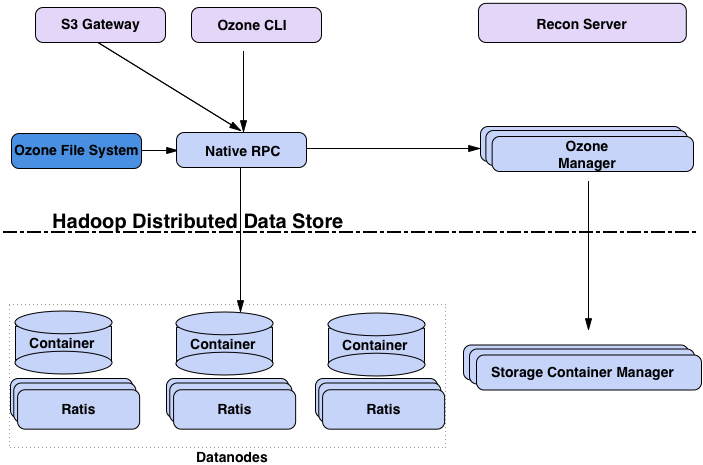
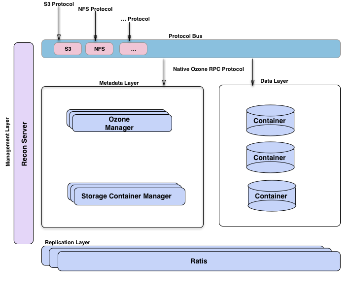

<!---
  Licensed to the Apache Software Foundation (ASF) under one or more
  contributor license agreements.  See the NOTICE file distributed with
  this work for additional information regarding copyright ownership.
  The ASF licenses this file to You under the Apache License, Version 2.0
  (the "License"); you may not use this file except in compliance with
  the License.  You may obtain a copy of the License at

      http://www.apache.org/licenses/LICENSE-2.0

  Unless required by applicable law or agreed to in writing, software
  distributed under the License is distributed on an "AS IS" BASIS,
  WITHOUT WARRANTIES OR CONDITIONS OF ANY KIND, either express or implied.
  See the License for the specific language governing permissions and
  limitations under the License.
-->

Ozone is a redundant, distributed object store optimized for Big data
workloads. The primary design point of ozone is scalability, and it aims to
scale to billions of objects.

Ozone separates namespace management and block space management; this helps
ozone to scale much better. The namespace is managed by a daemon called
[Ozone Manager ]() (OM),  and block space is
managed by [Storage Container Manager] () (SCM).

Ozone consists of volumes, buckets, and keys.
A volume is similar to a home directory in the ozone world.
Only an administrator can create it.

Volumes are used to store buckets.
Once a volume is created users can create as many buckets as needed.
Ozone stores data as keys which live inside these buckets.

Ozone namespace is composed of many storage volumes.
Storage volumes are also used as the basis for storage accounting.

The block diagram shows the core components of Ozone.

The Ozone Manager is the name space manager, Storage Container Manager
manages the physical and data layer and Recon is the management interface for
Ozone.

## Different Perspectives

Any distributed system can viewed from different perspectives. One way to
look at Ozone is to imagine it as Ozone Manager as a name space service built on
 top of HDDS, a distributed block store.

Another way to visualize Ozone is to look at the functional layers; we have a
 metadata data management layer, composed of Ozone Manager and Storage
 Container Manager.

We have a data storage layer, which is basically the data nodes and they are
 managed by SCM.

The replication layer, provided by Ratis is used to replicate metadata (Ozone
Manager and SCM) and also used for consistency when data is modified at the
data nodes.

We have a management server called Recon, that talks to all other components
of Ozone and provides a unified management API and UX for Ozone.

We have a protocol bus that allows Ozone to be extended via other
protocols. We currently only have S3 protocol support built via Protocol bus.
Protocol Bus provides a generic notion that you can implement new file system
 or object store protocols that call into O3 Native protocol.

