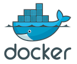
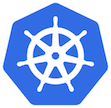
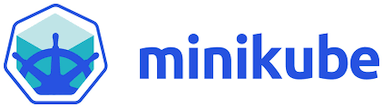

<!---
  Licensed to the Apache Software Foundation (ASF) under one or more
  contributor license agreements.  See the NOTICE file distributed with
  this work for additional information regarding copyright ownership.
  The ASF licenses this file to You under the Apache License, Version 2.0
  (the "License"); you may not use this file except in compliance with
  the License.  You may obtain a copy of the License at

      http://www.apache.org/licenses/LICENSE-2.0

  Unless required by applicable law or agreed to in writing, software
  distributed under the License is distributed on an "AS IS" BASIS,
  WITHOUT WARRANTIES OR CONDITIONS OF ANY KIND, either express or implied.
  See the License for the specific language governing permissions and
  limitations under the License.
-->

<nav aria-label="breadcrumb">
  <ol class="breadcrumb">
    <li class="breadcrumb-item"><a href="/">Home</a></li>
    <li class="breadcrumb-item active" aria-current="page">Getting Started</li>
  </ol>
</nav>

  

    <h3 class="display-4">Installing Ozone </h3>
    

There are many ways to install and run Ozone. Starting from simple docker
deployments on
local nodes, to full scale multi-node cluster deployment on
kubernetes or bare-metal.

  

  

    Easy Start
  

  

    <h3 class="card-title">Running Ozone from Docker Hub</h3>
    
 You can try out Ozone using docker hub without
    downloading the official release. This makes it easy to explore Ozone.

  
  

    <h4 class="card-title">Starting ozone inside a single container</h4>
    
The simplest and easiest way to start an ozone cluster
     to explore what it can do is to start ozone via docker.

     <a href=""
    class="btn btn-primary"> Ozone in Docker</a>
  

  

 
 

  

    Recommended
  

  

    <h3 class="card-title">Running Ozone from an Offical Release.</h3>
    

    Apache Ozone can also be run from the official release packages. Along with
    the official source releases, we also release a set of convenience binary
    packages. It is easy to run these binaries in different configurations.

  

  
  

    <h4 class="card-title">Deploying Ozone on a physical cluster.</h4>
    
Ozone is designed to work concurrently with HDFS.
    The physical cluster instructions explain each component of Ozone and
    how to deploy with maximum control.

     <a href=""
    class="btn btn-primary">On-Prem Ozone Cluster</a>
  

  

  
  

    <h4 class="card-title">Deploying Ozone on K8s</h4>
    
Ozone is designed to work well under kubernetes.
    These are
     instructions on how to deploy Ozone on  K8s platform. Ozone provides a
     replicated storage solution for K8s based Applications.
     

     <a href=""
    class="btn btn-primary">Ozone on Kubernetes</a>
  

 
 
 

  

  
  

    <h4 class="card-title">Deploy Ozone using MiniKube.</h4>
    
 Ozone comes with a standard set of K8s
    resources.
    You can deploy them to MiniKube and experiment with the K8s based
    deployments.
     
    

     <a href=""
    class="btn btn-primary">MiniKube Cluster</a>
  

  
  
  

  

  
  

    <h4 class="card-title">An Ozone cluster in Local Node.</h4>
    
 We also ship standard docker files with official
    release, if you want to use them. These are part of official release and
    not depend upon Docker Hub.
    

     <a href=""
    class="btn btn-primary">Multi-Container Cluster</a>
  

 
 

  

    Hadoop Ninja
  

  

    <h3 class="card-title">Building From Sources.</h3>
    
 Instructions to build Ozone from source to create
    deployment packages.

  
  

    <h4 class="card-title"></h4>
    
If you are a Hadoop ninja,
    and wise in the ways of Apache, you already know that a real
    Apache release is a source release. We believe that even ninjas need
    help at times. 

     <a href=""
    class="btn btn-primary">Creating a Release Package from Source.</a>
  

 
 
<a href=""> <button type="button"
class="btn  btn-success btn-lg">Next >></button>
