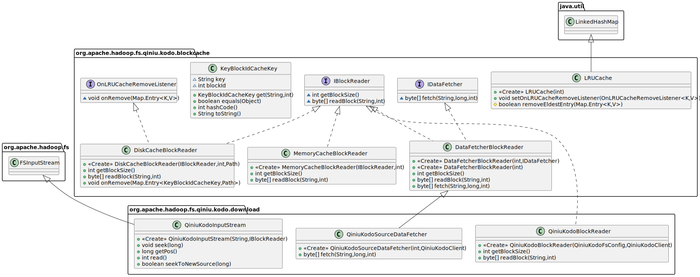

# 缓存需求分析

由于Hadoop的抽象文件系统对外提供的接口为一个可随机读取的字节流，而对象存储的文件下载实际上是通过HTTP协议进行文件下载的。

http协议本质上是基于tcp的数据流，并不直接提供基于字节的随机读取。

http协议请求头中规定了`Range`可实现分片下载，我们的随机读取将基于此来实现。

实际上，即使是本地文件系统，硬件层面的磁盘也并不提供字节粒度的随机读取，仅提供了按块读取的手段，故磁盘设备又称作块存储设备，通常磁盘块大小就是扇区大小即512字节。

我们可基于http的Range来根据`块号blockId`和`块大小blockSize`来模拟出一种块设备的读取方式，块大小为一次http请求获取数据的最大长度，设为`blockSize`，

当读取某个全局偏移量为`offset1`的字节时，可计算得出块号为`blockId = offset1 / blockSize`, 以及块内偏移 `offset2 = offset1 % blockSize`。
则目标块的全局偏移范围为`start = blockId * blockSize`, `end = start + blockSize`。

于是我们可以插入一个http请求头: `Range: bytes={start}-{end-1}`。

但是不可能每一次读取一个字节均完整读取一整块数据，故需要设计内存缓存。

由于内存需要控制不能占用太高，而占用太低又很容易出现缓存`抖动`现象，故还需要引入磁盘缓存层。

# 缓存策略

缓存策略使用常见的LRU缓存策略，存在一个最大缓存块数 maxCachedBlocks。
每当读取一个字节时，先查询缓存中是否存在该块的缓存，若存在则直接读取，并且将该块提前到队列头部，否则将穿透该层缓存层拉取数据并加入LRU缓存队列头部。
若新加入块时到达最大缓存块数 maxCachedBlocks，则自动删除队尾的数据块，下次读取该块数据时，缓存失效，将重新需要拉取数据进入缓存。

# 代码设计

首先通过继承LinkedHashMap实现了一种LRU的HashMap容器，通过设置OnLRUCacheRemoveListener可监听LRU缓存元素淘汰时回调。

设计一个接口`IBlockReader`，表示一个块读取的抽象，
`MemoryCacheBlockReader`表示内存缓存的块读取实现，
`DiskCacheBlockReader`表示磁盘缓存层的块读取实现。

设计一个接口 `IDataFetche`，表示一个根据偏移量与读取大小获取数据的抽象，
`DataFetcherBlockReader`是一个适配器层，可将IDataFetcher对象转化为一个`IBlockReader`对象。

编写一个类 `QiniuKodoSourceDataFetcher`，该类需要负责从配置文件获取块大小，并且能够从QiniuKodoClient对象按字节范围拉取数据。

编写一个类 `QiniuKodoBlockReader`，其中聚合了 `MemoryCacheBlockReader, DiskCacheBlockReader, QiniuKodoSourceDataFetcher, DataFetcherBlockReader`, 实现了最终带缓存层的分块读取的BlockReader。

继承Hadoop文件系统的字节输入流 `FSInputStream` 类，基于最终的 `QiniuKodoBlockReader` 完成编写了 `QiniuKodoInputStream` 类，实现文件的随机读取。